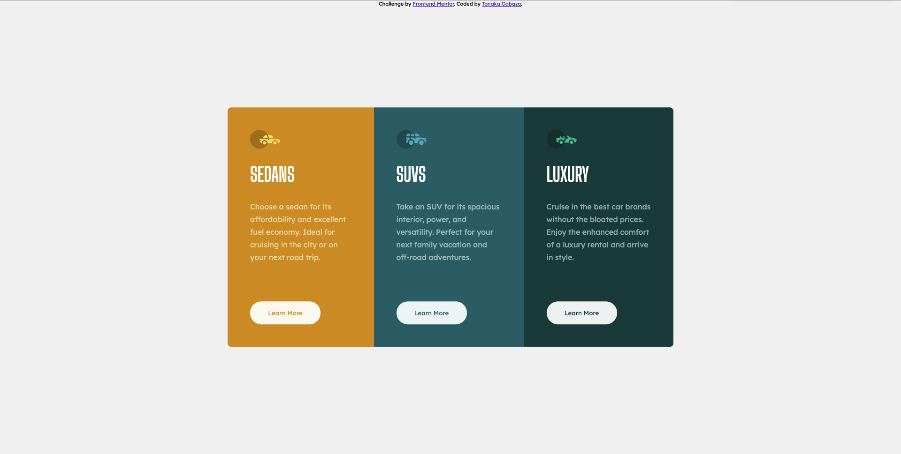

# Frontend Mentor - 3-column preview card component solution

This is a solution to the [3-column preview card component challenge on Frontend Mentor](https://www.frontendmentor.io/challenges/3column-preview-card-component-pH92eAR2-). Frontend Mentor challenges help you improve your coding skills by building realistic projects.

## Table of contents

- [Overview](#overview)
  - [The challenge](#the-challenge)
  - [Screenshot](#screenshot)
  - [Links](#links)
- [My process](#my-process)
  - [Built with](#built-with)
  - [What I learned](#what-i-learned)
  - [Continued development](#continued-development)
  - [Useful resources](#useful-resources)

## Overview

### The challenge

Users should be able to:

- View the optimal layout depending on their device's screen size
- See hover states for interactive elements

### Screenshot

### Links

- Solution URL: [frontendmentor-3-column-card](https://tagabaza.github.io/frontendmentor-3-column-card/)

## My process

### Built with

- Semantic HTML5 markup
- CSS custom properties
- Flexbox
- Responsive Design

### Useful resources

- [CSS-Tricks: Flexbox](https://css-tricks.com/snippets/css/a-guide-to-flexbox/) - This helped me understand flexbox in detail, giving out an in depth in its entirety; covering the background, properties, patterns, terminology and of course demos.

## Author

- Frontend Mentor - [@yourusername](https://www.frontendmentor.io/profile/yourusername)
